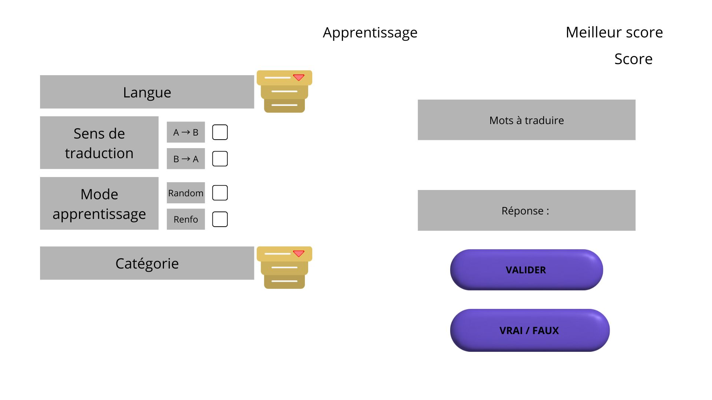

```{r setup, include=FALSE}
knitr::opts_chunk$set(echo = TRUE)
library(knitr)
```

# Description du projet : Application de traduction interactive
L’application a pour objectif d’aider les utilisateurs à améliorer leurs compétences linguistiques à travers des exercices de traduction ludiques et interactifs. Elle propose un système de jeu où l’utilisateur doit traduire des mots à partir d’une base de donnée préétablie ou avec des mots qu’il a enregistré 

# Un onglet “apprentissage” : 

```{r im1, echo=FALSE, out.width = '70%', fig.align = "center", fig.show = 'hold', fig.cap="Fig. 1: Onglet 'apprentissage'"}

```

## Fonctionnalités principales

### Langues disponibles :
L’application proposera dans un premier temps la traduction entre l’anglais et le français. Des extensions vers d’autres langues sont envisageables si des bases de données de traduction multilingues sont accessibles.

**Affichage** : Liste déroulante avec les langues disponibles

### Sélection des mots :
Les mots à traduire pourront être proposés de manière :

- Définir la langue de traduction

**Affichage** : liste déroulante 
	
- Aléatoire
- Renforcement des mots ou il y a le moins de taux de réussite proposition non aléatoire (plus le mots a un faible taux de réussite plus il a une probabilité de tomber). 

**Affichage** : 2 boutons sélectionnables (aléatoire/ renforcement)

- et/ou préconfigurée par catégorie (ex. : animaux, verbes irréguliers, objets du quotidien, etc.) à l’aide d’une liste déroulante.

**Affichage** :  liste déroulante (différents thèmes)

### Choix du sens de traduction: 

Faire du thème (langue étrangère vers français)
Faire de la version (français vers langue étrangère)

**Affichage** 
2 bouton sélectionnables (thème/version)
	
### Système de score
Avoir un système de score et de meilleur score. 

- Affichage du score en cours pendant la session.
- Affichage du meilleur score, soit enregistré dans le profil utilisateur (avec historique), soit conservé uniquement pour la session active, selon ce qui est possible de faire.

### Autres affichage :	
Affichage du mot à traduire, du champ de réponse, et du résultat immédiat (correct / incorrect) avec des couleurs (Rouge/vert).

# Un onglets “paramétrage” :

```{r im2, echo=FALSE,out.width = '70%', fig.align = "center", fig.cap="Fig. 2: Onglet 'paramétrage'"}
knitr::include_graphics("Image/im2.jpg")
```

Fonctionnalité principales :

- Avoir un onglet qui permet d'ajouter un mot et sa traduction.
- Pouvoir créer une nouvelle catégorie.
- Pouvoir ajouter le mot dans une catégorie et/ou une langue.

